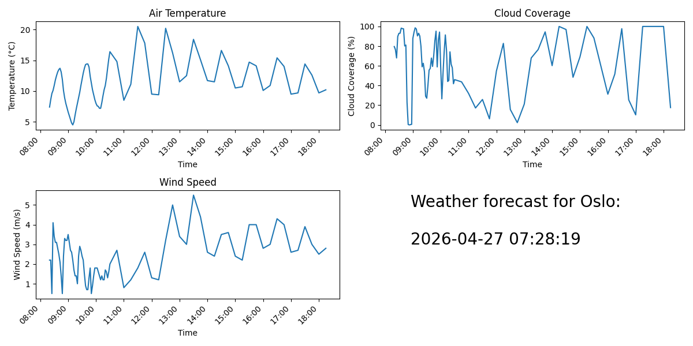

# Weather Forecaster for Oslo

## Overview
This application automates weather forecasting for Oslo by downloading weather reports from the MET API in JSON format, mapping the data in a plot, and converting the plot to a PNG image. The core functionality is handled by a [GitHub Actions workflow](.github/workflows/weather-forecaster.yml) that automates the entire process. This workflow uses a bot to commit the PNG image, effectively overriding the previous one and thus updating the README file with the latest forecast.

## Steps

1. **Fetch Forecast**: The script first calls our [API Integration](src/weather_forecast/api.py) to download the latest weather forecast in JSON format. The JSON files are stored in the [forecasts](forecasts) directory.

2. **Generate Visual Report**: The JSON data is processed to extract key weather details, such as temperature and wind speed. A [plot](src/weather_forecast/plotter.py) is generated using this data and saved as a PNG image. This image is committed to the repository in the [assets](assets) directory by a bot as part of the [GitHub Actions workflow](.github/workflows/weather-forecaster.yml).

3. **Update README**: Once the PNG is saved, the README is automatically updated to reflect the new forecast image, as it is replacing the previous one. The image is referenced in the README using Markdown, with the path pointing to the [assets](assets) directory.

Additionally, you can run the application [locally](src/weather_forecast/local.py) to choose and visualize a forecast from a specific past date.

## Current forecast


## Development

This project uses [uv](https://docs.astral.sh/uv/) for dependency management and [ruff](https://docs.astral.sh/ruff/) (via pre-commit) for linting and formatting.

### 1. Install uv

Follow the [official installation instructions](https://docs.astral.sh/uv/getting-started/installation/). On macOS/Linux:

```sh
curl -LsSf https://astral.sh/uv/install.sh | sh
```

### 2. Sync dependencies

From the repo root:

```sh
uv sync
```

This creates a local `.venv/` and installs both runtime and dev dependencies from `pyproject.toml` / `uv.lock`.

### 3. Configure environment variables

Copy the example file and fill in the values:

```sh
cp .env.example .env
```

- `WEATHER_FORECAST_API_URL` — the MET locationforecast endpoint (with lat/lon).
- `USER_AGENT` — required by the MET API; use a descriptive name + contact email.

### 4. Run the scripts

```sh
uv run fetch-forecast   # fetch today's forecast and plot it
uv run plot-local       # interactively plot a previously saved forecast
```

Both must be run from the repo root (paths to `forecasts/` and `assets/` are relative).

PyCharm users: the `.run/` directory ships `Fetch Forecast` and `Plot Local` run configurations that pick up `.env` automatically.

### 5. Run tests

```sh
uv run pytest
```

CI runs the same command with coverage. To see coverage locally:

```sh
uv run pytest --cov=weather_forecast --cov-report=term
```

### 6. Pre-commit hooks

Install the git hook once per clone so ruff runs on every commit:

```sh
uv run pre-commit install
```

Run the hooks across the whole repo at any time:

```sh
uv run pre-commit run --all-files
```

Lint / format on demand without pre-commit:

```sh
uv run ruff check .
uv run ruff format .
```

The same `ruff check` and `ruff format --check` commands gate the GitHub Actions workflow, so commits that pass locally will pass CI.
