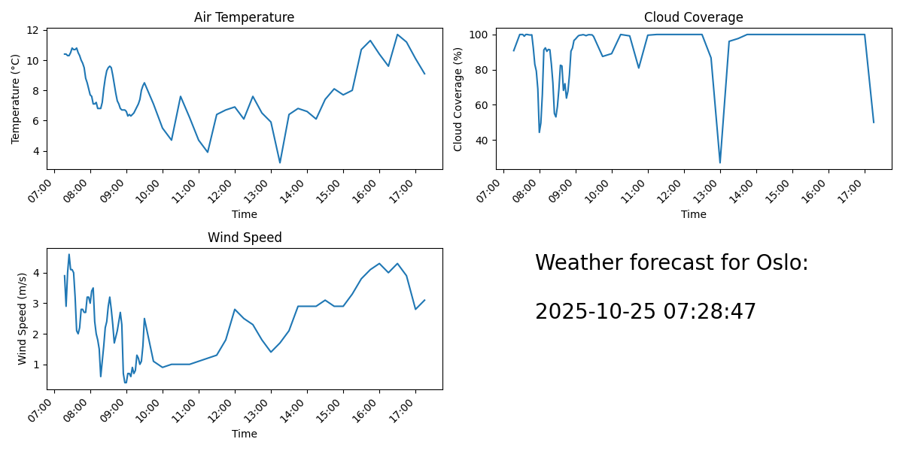

# Weather Forecaster for Oslo

## Overview
This application automates weather forecasting for Oslo by downloading weather reports from the MET API in JSON format, mapping the data in a plot, and converting the plot to a PNG image. The core functionality is handled by a [GitHub Actions workflow](.github/workflows/weather-forecaster.yml) that automates the entire process. This workflow uses a bot to commit the PNG image, effectively overriding the previous one and thus updating the README file with the latest forecast.

## Steps

1. **Fetch Forecast**: The script first calls our [API Integration](api.py) to download  the latest weather forecast in JSON format. The JSON files are stored in the [forecast](forecasts) directory.

2. **Generate Visual Report**: The JSON data is processed to extract key weather details, such as temperature and wind speed. A [plot](plotter.py) is generated using this data and saved as a PNG image. This image is committed to the repository in the [assets](assets) directory by a bot as part of the [GitHub Actions workflow](.github/workflows/weather-forecaster.yml).

3. **Update README**:  Once the PNG is saved, the README is automatically updated to reflect the new forecast image, as it is replacing the previous one. The image is referenced in the README using Markdown, with the path pointing to the [asset](assets) directory.

Additionally, you can run the application [locally](local.py) to choose and visualize a forecast from a specific past date.

## Current forecast

